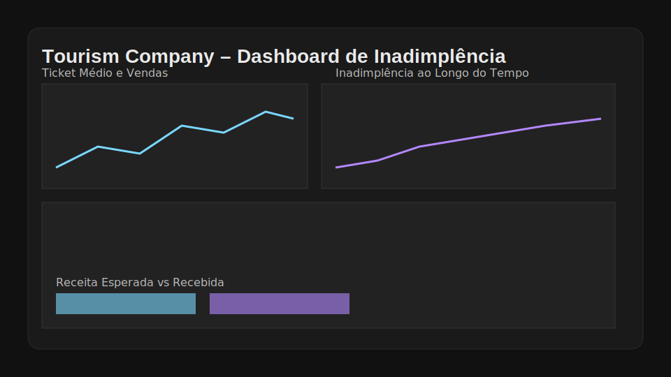

# Tourism Company Delinquency

Visão completa e profissional da inadimplência em pagamentos recorrentes mensais, desde EDA e limpeza até respostas às perguntas de negócio, dashboard interativo em HTML e relatório editável.

## Sumário
- [Visão Geral do Projeto](#visao-geral-do-projeto)
- [Objetivos da Análise](#objetivos-da-analise)
- [Estrutura do Projeto](#estrutura-do-projeto)
- [Base de Dados](#base-de-dados)
- [Metodologia de Análise](#metodologia-de-analise)
- [Resultados Chave e Apresentação](#resultados-chave-e-apresentacao)
- [Tecnologias Utilizadas](#tecnologias-utilizadas)
- [Instalação e Uso](#instalacao-e-uso)
- [Publicação no GitHub Pages](#publicacao-no-github-pages)
- [Licença](#licenca)
- [Contato](#contato)

## Visão Geral do Projeto
Projeto de análise de inadimplência em pagamentos recorrentes mensais na empresa de turismo, cobrindo EDA, limpeza, modelagem de cronogramas de parcelas, alocação de pagamentos, KPIs e visualização executiva. O foco é responder perguntas de negócios sobre mudanças estratégicas (ticket alto, expansão do recorrente, WhatsApp de cobrança, produtos premium) e política de juros.

## Objetivos da Análise
- Medir impacto da priorização de ticket médio alto (jan/2021).
- Avaliar a expansão do parcelamento recorrente (jul/2021).
- Medir o efeito da plataforma de cobrança via WhatsApp (jul/2021).
- Analisar oferta de produtos premium (ago/2024).
- Verificar se a taxa de juros cobre perdas por inadimplência e sugerir diferenciação entre recorrente e tradicional.

## Estrutura do Projeto
- data/raw: arquivos originais (.xlsx, .pdf)
- data/processed: bases tratadas, cronograma e alocações
- notebooks: fluxo 01 → 04
- reports: dashboard.html, respostas_empresa.md e business_report.md
- docs: artefatos para GitHub Pages (index.html, dashboard.html, favicon.ico, respostas_empresa.md)
- src: utilitários de carregamento, métricas, visualização e relatório
- dashboard_viasul.py: dashboard com abas e filtros globais (Streamlit)

## Base de Dados
- Base principal: Base Pagamentos.xlsx
- Identificação automática de colunas típicas (português/inglês); padrões ajustáveis em src/config.py.

## Metodologia de Análise
- EDA e limpeza; tipagem de datas e valores.
- Construção do cronograma de parcelas por contrato a partir da data de compra e número de parcelas.
- Alocação de pagamentos ao cronograma em ordem (FIFO por contrato).
- Inadimplência por maturidade (recorrente): um contrato só entra como inadimplente quando todas as parcelas venceram e o total pago < total esperado.
- KPIs mensais: ticket médio, volume, share recorrente, receita esperada vs. recebida.
- Juros x perdas: taxa de referência do case (2,49% a.m.) aplicada para estimativa e comparação com perdas.

## Resultados Chave e Apresentação
- Dashboard (HTML, tema escuro): [reports/dashboard.html](reports/dashboard.html)
- Relatório de respostas (Markdown): [reports/respostas_empresa.md](reports/respostas_empresa.md)
- Aba Cohort no dashboard: curva em área de % inadimplência vs % recorrente
- Para apresentação: cada resposta em `respostas_empresa.md` aponta a aba e o gráfico correspondente no dashboard

## Tecnologias Utilizadas
- Python, pandas, numpy
- Plotly (visualização)
- Streamlit (dashboard com abas e filtros)
- nbconvert/nbformat (execução de notebooks)
- PyPDF2 (extração de texto do PDF)

## Instalação e Uso
1. Criar/ativar ambiente no kernel “Python (base)”.
2. Instalar dependências:
   - `pip install -r requirements.txt`
3. Executar notebooks em ordem (JupyterLab):
   - 01_eda.ipynb → 02_limpeza_e_engenharia.ipynb → 03_analise_perguntas_de_negocio.ipynb → 04_relatorio.ipynb
4. Abrir o dashboard e o relatório em `reports/`.
5. Gerar o pacote de entrega (MD):
   - `python scripts/build_deliverables.py`
6. Atualizar GitHub Pages (docs/):
   - `python scripts/build_pages.py`
7. Rodar o dashboard com filtros e abas (Streamlit):
   - `streamlit run dashboard_viasul.py`

## Publicação no GitHub Pages
- Ative o GitHub Pages em **Settings → Pages**.
- Em **Build and deployment**, selecione **Deploy from a branch**, branch **main**, pasta **/docs**.
- URL do dashboard: https://flaviohenriquehb777.github.io/Tourism_Company_Delinquency/

## Licença
- Este projeto está licenciado sob a licença MIT. Consulte [LICENSE.md](LICENSE.md).

## Contato
- Nome: **Flávio Henrique Barbosa**
- LinkedIn: [linkedin.com/in/flávio-henrique-barbosa-38465938](https://www.linkedin.com/in/fl%C3%A1vio-henrique-barbosa-38465938)
- Email: [flaviohenriquehb777@outlook.com](mailto:flaviohenriquehb777@outlook.com)
 
 
 
 
 
 
 
 
 
 
 
 
 
 
 
 
 
 
 
 
 
 
 
 
